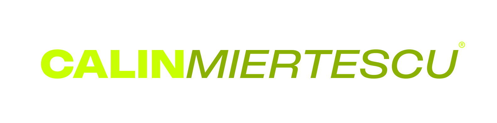

  

 

MSc student in **Artificial Intelligence & Applied Computing** at the University of Craiova, building software by day and AI-assisted football graphics by night. Founder of **Framework Society**, a small studio doing marketing, automation and digital work for SMEs.

 

### Some of my projects

- **VitaBalance** — explainable, rule-based nutrition recommendation system (bachelor's thesis)
- **DeepWork** — Kotlin/Jetpack Compose focus app with a Ktor WebSocket desktop companion
- **MedFlow AI** — health-tech app built in 48h at Craiova Hackathon 2025
- **TechStore** — full-stack e-commerce, Next.js + FastAPI

 

### Stack

 

 

 

### Activity

 

### Currently

Learning Docker, advanced React patterns and system design — and rebuilding the Calin Graphics mark itself into something sharper.

 

 Craiova, Romania

